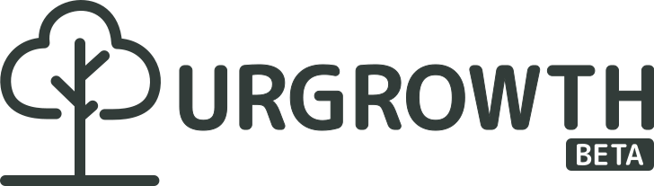

<p align="center"></p>

<p align="center">
This is the repository for the URGROWTH website. It is built using Nuxt, TailwindCSS and DaisyUI.
</p>

## 📝 Table of Contents

- [📝 Table of Contents](#-table-of-contents)
- [🙋‍ What is URGROWTH?](#-what-is-urgrowth)
- [🤔 How we can help you?](#-how-we-can-help-you)
- [😎 Cool, what should I contribute?](#-cool-what-should-i-contribute)
- [🚀 Getting Started](#-getting-started)
  - [Prerequisites](#prerequisites)
  - [Installation](#installation)
  - [Running the development server](#running-the-development-server)
  - [Building for production](#building-for-production)
- [🤝 Contributing](#-contributing)
- [📝 License](#-license)
- [💰 Sponsor](#-sponsor)

## 🙋 What is URGROWTH?

We are dedicated to encouraging the youths through our website to set out on a journey of self-discovery and self-empowerment.

We genuinely think that every person has a distinct identity that is just waiting to be revealed, and we want you to proudly embrace it.

Our goal is to assist you in realizing your full potential and utilizing your skills and assets so that you can have a positive influence on society.

Our services are intended to lead you down this transforming path and help you become your greatest self, whether you are a student, a young adult, or anybody else that is seeking personal growth and development.

Join us in this inspiring endeavor, and let society and yourself benefit from your true identity shining.

## 🤔 How we can help you

1. We are a medium of creative youths with a passion for personal growth and development, for building a better society, and for making a difference in the world.
2. We have learning processes that are designed to help you discover your true identity and purpose in life.
3. We have a community of like-minded people who are willing to help you grow and develop. Such as coaches, mentors, and other youths.

## 😎 Cool, what should I contribute?

You should check out our [Figma](https://www.figma.com/file/G0Nt7pkqjuE6vd6lMLvBBL/URGROWTH-Flowchart?type=whiteboard&node-id=0%3A1&t=GtXPIXAAHIT2KM7Y-1)
and [Discord](https://discord.com/invite/gZg86g2UB3) to see what we are up to.

## 🚀 Getting Started

### Prerequisites

- [Node.js](https://nodejs.org/en/) (>=14.0.0)
- [PNPM](https://pnpm.io/) (>=6.0.0)
- [Git](https://git-scm.com/)

### Installation

1. Clone the repository

```bash
git clone https://github.com/urgrowth/web
```

2. Install the dependencies

```bash
pnpm install
```

### Running the development server

```bash
pnpm run dev
```

### Building for production

```bash
pnpm run build
```

## 🤝 Contributing

See [CONTRIBUTING.md](./CONTRIBUTING.md)

## 📝 License

This project is licensed under the [MIT License](./LICENSE)

## 💰 Sponsor & Partners

If you like this project, please consider [sponsoring us](https://github.com/sponsors/tinarskii) to support our work.

<p align="center"><a href="https://www.acsp.ac.th/"></a></p>
